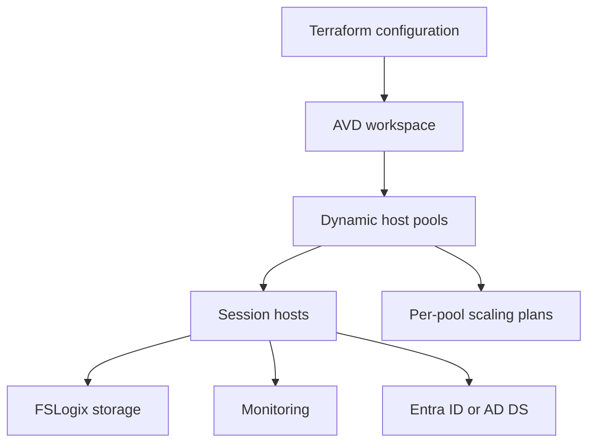

# Azure Virtual Desktop Environment Factory

[](https://github.com/YOUR_GITHUB_USERNAME/azure-avd-environment-factory/actions/workflows/terraform-plan.yml)
[](https://github.com/YOUR_GITHUB_USERNAME/azure-avd-environment-factory/actions/workflows/security.yml)
[](https://developer.hashicorp.com/terraform)
[](https://azure.microsoft.com/products/virtual-desktop)
[](LICENSE)

**Azure Virtual Desktop Environment Factory** is a reusable Terraform framework
for deploying scalable, secure, and standardized AVD environments. Organizations
can define any number of host pools, session hosts, scaling policies, storage
configurations, identity modes, and monitoring settings through configuration
without modifying the underlying modules.

Four host pools are only the example. The same code can deploy two, four, six,
or twenty host pools through a map and `for_each`.

## Why this project matters

AVD deployments often become collections of copied Terraform blocks. This
factory turns the environment into a data model: each host-pool key carries its
capacity, VM image, load-balancing, scaling, timezone, shutdown, and tagging
policy. Shared services are created once and every pool follows the same secure,
observable baseline.

The design reflects operational patterns proven at larger AVD scale: centralized
orchestration, configurable controls, approval-gated changes, health validation,
monitoring, repeatable documentation, and dependency-aware scaling.

## Features

- Any number of host pools through a typed Terraform map
- Per-pool session-host count and VM size
- Pooled and personal desktop support
- Small, medium, large, and custom capacity profiles
- Host-pool-specific AVD scaling schedules and time zones
- Azure Files or Azure NetApp Files FSLogix storage
- Azure Files Entra Kerberos or AD DS authentication and profile-user RBAC
- Microsoft Entra join or traditional Active Directory domain join
- Desktop application groups and workspace registration
- User and administrator RBAC assignments
- VNet, separate subnets, NSG, custom DNS, and optional private endpoints
- Log Analytics, AVD diagnostics, Azure Monitor Agent, and performance counters
- Key Vault integration and generated administrator password
- Marketplace or Azure Compute Gallery/custom image selection
- Standardized naming and merged organization/pool tags
- Optional VM shutdown schedules
- Resource-group budget and email threshold notification
- GitHub Actions plan, manually approved apply, and IaC security scanning
- PowerShell health and post-deployment validation scripts
- Native Terraform tests for built-in and custom capacity profiles

## Architecture



See the detailed [architecture](docs/ARCHITECTURE.md).

## Four-pool custom example

```hcl
capacity_profile = "custom"

host_pools = {
  dev = {
    type            = "Pooled"
    session_hosts   = 2
    vm_size         = "Standard_D4s_v5"
    peak_start_time = "08:00"
    peak_end_time   = "18:00"
  }

  qa = {
    type                   = "Pooled"
    session_hosts          = 2
    vm_size                = "Standard_D4s_v5"
    peak_start_time        = "09:00"
    peak_end_time          = "17:00"
    off_peak_minimum_hosts = 1
  }

  prod-us = {
    type                   = "Pooled"
    session_hosts          = 5
    vm_size                = "Standard_D8s_v5"
    peak_minimum_hosts_pct = 60
    off_peak_minimum_hosts = 1
  }

  prod-eu = {
    type             = "Pooled"
    session_hosts    = 4
    vm_size          = "Standard_D8s_v5"
    scaling_timezone = "W. Europe Standard Time"
  }
}
```

Remove a map key and Terraform proposes removal of that pool. Add `contractors`
and Terraform proposes the fifth pool. A protected plan review is therefore a
required safety control.

## Capacity profiles

```hcl
capacity_profile = "medium"
```

| Profile | Host pools | Session hosts |
| --- | ---: | ---: |
| Small | 4 | 1 per pool |
| Medium | 4 | 3 per pool |
| Large | 6 | 5 per pool |
| Custom | Any | Per-pool |

These are demonstrative defaults, not universal sizing recommendations. See
[capacity profiles](docs/CAPACITY-PROFILES.md).

## Quick start

```bash
git clone https://github.com/YOUR_GITHUB_USERNAME/azure-avd-environment-factory.git
cd azure-avd-environment-factory
az login
cp terraform/terraform.tfvars.example terraform/terraform.tfvars
terraform -chdir=terraform init -backend=false
terraform -chdir=terraform fmt -check -recursive
terraform -chdir=terraform validate
terraform -chdir=terraform plan
```

Update the placeholder subscription, tenant, email, prefix, RBAC principal IDs,
networking, capacity, and identity values before planning. For AD DS join, pass
the password through `TF_VAR_domain_join_password`; do not store it in tfvars.

Read the [deployment guide](docs/DEPLOYMENT.md) before using remote state or CI.

## Image choices

Each pool can use a Marketplace image:

```hcl
image_publisher = "MicrosoftWindowsDesktop"
image_offer     = "windows-11"
image_sku       = "win11-23h2-avd"
image_version   = "latest"
```

Or set `image_id` to an Azure Compute Gallery image version or managed image ID.

## Safe GitHub Actions delivery

- Pull requests run format, initialize, validate, and plan.
- Azure login uses OIDC rather than a stored client secret.
- Apply is manual and tied to a protected GitHub environment.
- The protected job applies the exact binary plan produced by its preceding plan job.
- Production should require a human reviewer between the plan and apply jobs.
- Trivy scans Terraform for high and critical IaC issues.

## Repository structure

```text
.
├── .github/workflows/        # Plan, protected apply, security scan
├── docs/                     # Architecture, deployment, capacity, operations
├── scripts/                  # PowerShell health and validation automation
└── terraform/
    ├── environments/         # Dev, test, production examples
    ├── modules/
    │   ├── avd-host-pool/    # Host pool, app group, scaling, diagnostics
    │   ├── fslogix/          # Azure Files or ANF
    │   ├── key-vault/        # Secrets and optional private endpoint
    │   ├── monitoring/       # Log Analytics, AMA, DCR
    │   ├── networking/       # VNet, subnets, NSG
    │   └── session-host/     # NICs, VMs, join, AVD agent, shutdown
    ├── main.tf
    ├── variables.tf
    └── terraform.tfvars.example
```

## Validation and operations

```powershell
./scripts/health-check.ps1 `
  -ResourceGroupName rg-demo-prod-avd `
  -HostPoolName vdpool-demo-prod-prod-us

./scripts/validate-avd.ps1 -ResourceGroupName rg-demo-prod-avd
```

See the [operations runbook](docs/OPERATIONS.md) for safe scale-out, drain-mode
scale-in, monitoring, recovery, and cost governance.

## Important production considerations

- AVD and VM sizing must be load-tested for the actual applications and users.
- Active Directory join requires reachable DNS and domain controllers.
- ANF SMB requires additional directory integration and a delegated subnet.
- FSLogix data needs its own backup, restore, capacity, and retention design.
- Protect state because it contains sensitive values even when outputs are marked.
- Private-only data planes require a VNet-connected self-hosted runner; the
  default GitHub-hosted workflow keeps public data-plane access enabled.
- Review Azure regional availability, quotas, naming, policy, and image terms.

## License

[MIT](LICENSE) © 2026 Umair Gulfam
