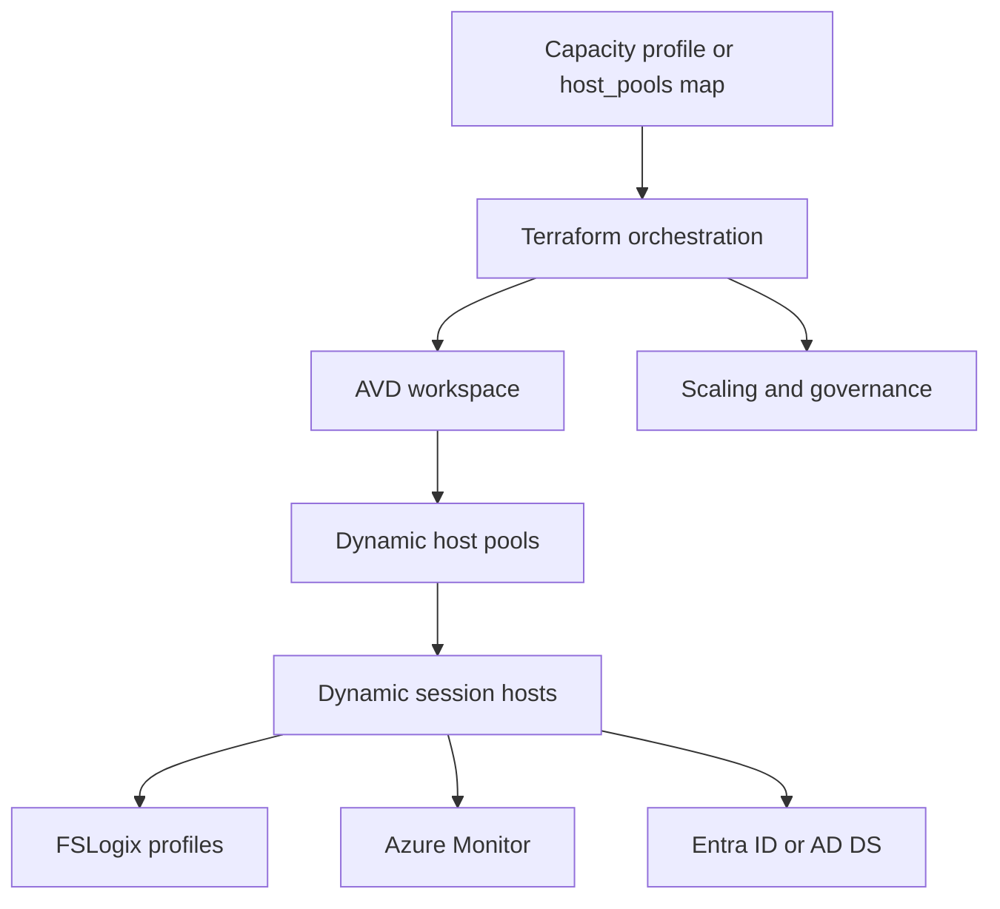

# Architecture

Each map key becomes an independently managed host-pool stack through
`for_each`. Each pool then creates its requested number of NICs, virtual
machines, identity extensions, AVD agent registrations, monitoring agents, and
optional shutdown schedules.

## Shared services

- One environment-specific resource group and AVD workspace
- VNet, session-host subnet, private-endpoint subnet, and NSG
- Azure Files or Azure NetApp Files FSLogix storage
- Log Analytics workspace, Azure Monitor Agent, and data collection rule
- Key Vault for generated local administrator credentials
- Resource-group budget, common tags, and RBAC assignments

## Lifecycle behavior

Adding a `host_pools` key creates a pool. Increasing `session_hosts` creates
additional indexed VMs. Removing a key proposes destruction of that host pool,
its application group, scaling plan, NICs, VMs, and registrations. Always
review the plan and drain users before approving destructive changes.

