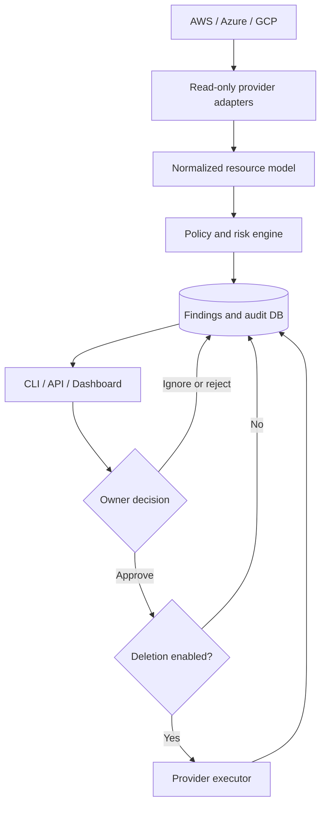

# Architecture

## Design decisions

- **Normalized model:** cloud-specific inventory becomes one portable resource
  schema, keeping policies testable and provider-neutral.
- **Evidence before action:** every finding carries a reason, observed evidence,
  confidence, owner, and estimated monthly savings.
- **Separation of duties:** approval does not execute deletion. Execution is a
  separate authenticated action and globally disabled by default.
- **Idempotent findings:** deterministic fingerprints prevent repeat scans from
  creating duplicate records.
- **Adapter boundary:** new clouds or services implement `CloudProvider` without
  changing the detector or workflow.

## Production hardening

Use PostgreSQL instead of SQLite, an identity-aware proxy instead of a shared
API key, a scheduler such as GitHub Actions or a managed container job, native
cost APIs for exact pricing, and a queue for deletion jobs. Add dependency graph
checks and organization-specific retention/legal-hold policies before enabling
real deletion.

