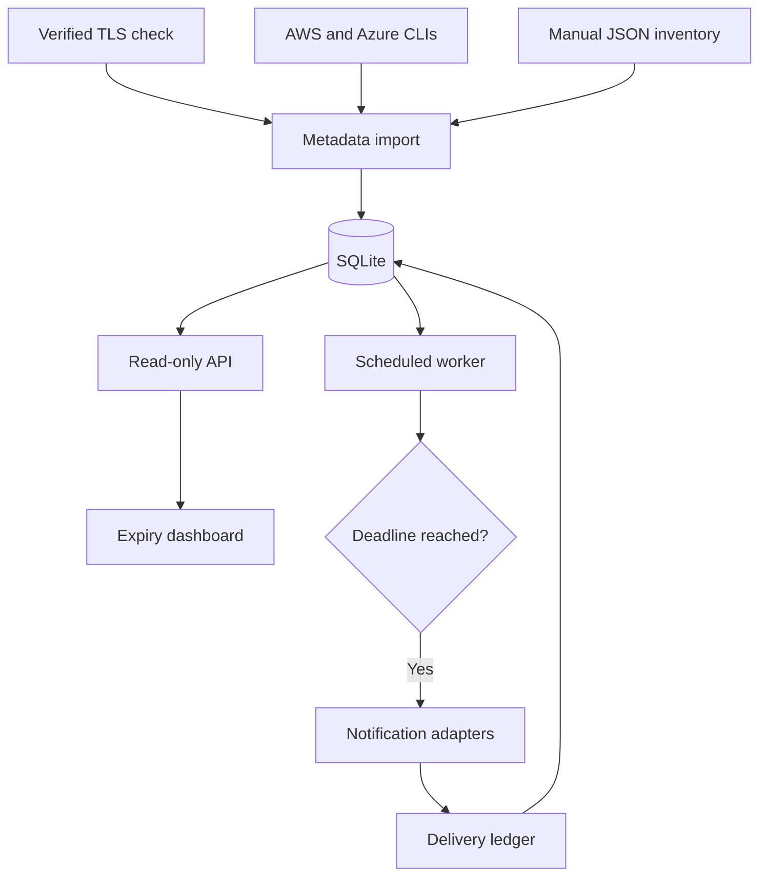

# Secret Expiry Radar

**A centralized, metadata-only dashboard for credential expiry and rotation deadlines.**

Built as a DevOps / Cloud Engineering reference project by **Umair Gulfam**. Python 3.11+, SQLite, a dependency-free browser interface, Docker Compose, and GitHub Actions. MIT licensed.

> This is a working single-node reference implementation. It is not a secrets vault or a production-certified service. Sample records are synthetic. No cloud accounts or notification destinations are preconfigured.

## What it does

- Tracks TLS certificates, API keys, AWS access keys, Azure application credentials, GitHub tokens, SSH keys, DNS-service certificates, and OAuth credentials.
- Shows overdue, critical, warning, healthy, and **unknown** states with owner, environment, and UTC deadline.
- Searches and filters the inventory; refreshes every 60 seconds.
- Collects verified TLS certificate expiry; imports AWS IAM access-key metadata and Azure application credential metadata through authenticated cloud CLIs.
- Supports atomic JSON inventory imports for any supported credential type.
- Stores local notifications at 30 days; delivers Slack at 14 days, email at 7 days, and PagerDuty at 3 days.
- Persists delivery history across restarts, retries unsuccessful channels on the next check, and separates dry runs from real delivery.
- Ships a non-root container, local-only published port, persistent volume, automated tests, CI, Dependabot, and operational documentation.

## Quick start — no dependencies to install

Requires Python 3.11 or later. Open a terminal in the extracted repository folder:

```bash
python -m radar demo
python -m radar check
python -m radar serve
```

Open **http://127.0.0.1:8080**. The sample data includes the requested API certificate, GitHub token, and Azure service principal examples. `demo` refuses to overwrite an existing inventory.

The local server binds to loopback. No token is required unless `RADAR_API_TOKEN` is set. All checking commands are dry runs unless `--send` is specified. The dashboard is read-only; inventory changes use the CLI.

For a separate demo database:

```bash
python -m radar --db data/demo.db demo
python -m radar --db data/demo.db serve
```

No Python third-party runtime dependencies are required. Optional installation provides the `secret-expiry-radar` command:

```bash
python -m pip install .
secret-expiry-radar --help
```

## Docker Compose

Requires Docker with Compose v2.

1. Copy `.env.example` to `.env` (`cp .env.example .env` on macOS/Linux; `Copy-Item .env.example .env` in PowerShell).
2. Generate a token using the command below and paste it into `RADAR_API_TOKEN` in `.env`.
3. Build and seed a demo inventory before starting the services.

```bash
python -c "import secrets; print(secrets.token_urlsafe(32))"
docker compose build
docker compose run --rm dashboard python -m radar demo
docker compose up -d
```

Open **http://127.0.0.1:8080** and enter the token. The browser retains it only in page memory.

Compose starts one dashboard and **one hourly delivery worker**. In demo use, leave all external alert settings blank: only local notification delivery is enabled. Once Slack, SMTP, or PagerDuty credentials are configured, the worker can send real messages. Use your own inventory before enabling them.

```bash
docker compose logs --tail=50 worker
docker compose run --rm dashboard python -m radar check
docker compose down
```

`docker compose down` retains data. `docker compose down -v` deletes it. The application needs no administrator privileges inside the container. AWS/Azure CLIs are intentionally not bundled; run collectors on an authenticated management host and import their exported metadata.

## Inventory and live collection

See [inventory reference](docs/INVENTORY.md) and [collector setup](docs/COLLECTORS.md).

```bash
python -m radar import examples/inventory.json
python -m radar collect tls api.example.com --owner "Platform team"
python -m radar collect aws deploy-user --owner "Cloud operations" --rotation-days 90
python -m radar collect azure YOUR-APPLICATION-ID --owner "Identity team"
python -m radar export
```

`api.example.com` and `YOUR-APPLICATION-ID` are placeholders; replace them with resources you own. Do not enter secret values in metadata. JSON imports upsert by ID and do not delete records missing from a subsequent import.

## Alert policy

| Time remaining | Channel | Configuration |
|---|---|---|
| ≤30 days | Local dashboard notification ledger | No external service |
| ≤14 days | Slack | `SLACK_WEBHOOK_URL` |
| ≤7 days | Email via authenticated TLS SMTP | `SMTP_*` variables |
| ≤3 days, including overdue | PagerDuty Events API v2 | `PAGERDUTY_ROUTING_KEY` |

Thresholds are cumulative. A newly discovered credential expiring in two days is eligible for all four channels. Each channel sends once per asset ID and deadline; failed/unconfigured deliveries remain eligible. Every real run reports sent, skipped, and failed counts. `check --send` returns a nonzero exit code if any eligible external channel fails or is unconfigured. A dry run never marks a delivery complete.

```bash
python -m radar check                  # Preview only
python -m radar check --send           # Deliver configured alerts
python -m radar worker --send          # Repeat hourly until stopped
```

Configure environment variables in the shell for native Python execution; `.env` is automatically loaded **only by Compose**. See [alert setup](docs/ALERTS.md).

## Architecture



The UI cannot launch network probes or modify credentials. Cloud credentials remain in the operator's CLI environment. The server returns only stored metadata. Collection and notification delivery are separate jobs; the worker evaluates existing metadata and does not automatically refresh it.

## Credential semantics

AWS IAM access keys and ordinary SSH keys often have no intrinsic expiry; use `created_at` plus `rotation_days`. A record with no valid expiry or rotation policy is **unknown**, never healthy. Where both are present, the earlier deadline wins.

“DNS certificates” is interpreted here as certificates used by a DNS service or DNS-validation-managed TLS certificates. DNSSEC signatures, domain-registration expiry, and ACME DNS challenges are different concepts and have no native collector in this release.

GitHub/API/OAuth token expiration is not universally discoverable. Track issuer-provided expiration metadata; no fabricated deadline is inferred. The Azure collector covers application-registration credentials, not all Azure Key Vault secrets or service-principal objects.

## Validation

```bash
python -m unittest discover -s tests -v
python -m compileall -q radar
node --check radar/static/app.js
```

Tests cover UTC/threshold boundaries, rotation versus expiration, atomic imports, persistent deduplication, retries, dry-run isolation, collector mappings, PagerDuty payloads, API authentication, and static routes. CI runs Python 3.11–3.13 and builds/smoke-tests the Docker image. Live integrations require your credentials and should first be tested with non-production destinations. See [validation report](docs/VALIDATION.md) for checks actually run during preparation.

## Repository layout

```text
radar/                  CLI, policy, database, collectors, alert adapters, HTTP server
radar/static/           Dashboard HTML, CSS and JavaScript
examples/               Synthetic metadata examples
tests/                 Automated Python tests
docs/                  Setup, architecture, operations and validation
.github/                CI, Dependabot and pull request template
Dockerfile              Non-root runtime image
compose.yaml            Dashboard + worker + persistent data
.env.example            Empty configuration template
pyproject.toml          Optional installable Python package
```

## Publish to GitHub

See [GitHub upload guide](docs/GITHUB.md). Extract the ZIP and upload the **contents of the `secret-expiry-radar` folder**, including `.github`, `.gitignore`, `.dockerignore`, and `.env.example`. Do not upload a ZIP as the repository's only file. Exclude `.env`, databases, cloud credentials, and real inventory exports.

## Operating limits and future work

- One host and one worker per SQLite database; no high availability or distributed locking.
- Delivery is at-least-once: a crash after external acceptance and before local commit can produce a duplicate. PagerDuty also receives a stable deduplication key.
- Collection is explicit and must be scheduled independently. Removed/revoked credentials are not automatically reconciled.
- The standard-library HTTP server is for local/reference use. For remote access use a hardened TLS authentication proxy, network restrictions, and a production service review. A bearer token alone is not enterprise access control.
- Automatic renewal is deliberately not implemented. Credential rotation needs provider-specific write permissions, dependent-system updates, health checks, and rollback. See [renewal design](docs/RENEWAL.md).
- PagerDuty incidents are triggered, but not automatically resolved when a deadline changes.
- No built-in SSO/RBAC, encrypted database, audit-grade history, or automatic cloud-wide discovery.

See [security policy](SECURITY.md), [operations](docs/OPERATIONS.md), and [contributing](CONTRIBUTING.md).
